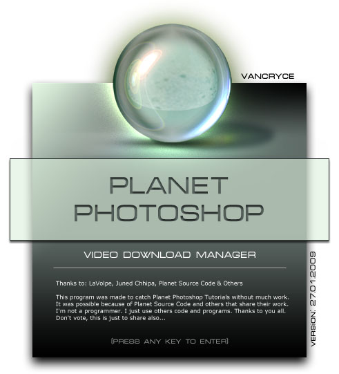



## Planet Photoshop Video Download Manager \- 27\.01\.2009

### Description

This is a Software that catchs Video Files in *.flv format, from Planet Photoshop Site.

Uses controls from LaVolpe, Juned Chhipa and Others. Great code to learn &amp; use. Thanks to them and to PSC. Updated (27.01.2009).
 
### More Info
 

             |
---                |---
**Submitted On**   |2009-01-27 12:20:08
**By**             |[Vancryce](https://github.com/Planet-Source-Code/PSCIndex/blob/master/ByAuthor/vancryce.md)
**Level**          |Beginner
**User Rating**    |5.0 (30 globes from 6 users)
**Compatibility**  |VB 6\.0
**Category**       |[Complete Applications](https://github.com/Planet-Source-Code/PSCIndex/blob/master/ByCategory/complete-applications__1-27.md)
**World**          |[Visual Basic](https://github.com/Planet-Source-Code/PSCIndex/blob/master/ByWorld/visual-basic.md)
**Archive File**   |[Planet\_Pho2141741272009\.zip](https://github.com/Planet-Source-Code/vancryce-planet-photoshop-video-download-manager-27-01-2009__1-71570/archive/master.zip)

